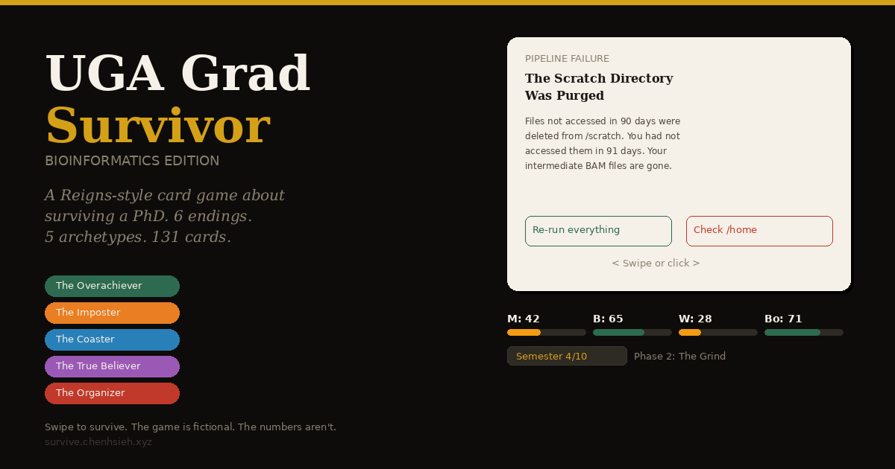

# UGA Grad Survivor: Bioinformatics Edition

**A Reigns-style card game about surviving a PhD.**
Swipe left. Swipe right. Try not to lose your mind, your health, your money, or your relationships.

[Play Now →](https://chenhsieh.github.io/UGA-grad-survivor/)



---

## How to Play

You're a PhD student in bioinformatics at the University of Georgia. Every card presents a situation — swipe left or right to make a choice. Each choice affects your stats:

- 🧠 **Mind** — sanity, focus, will to continue
- 💪 **Body** — physical health, sleep, energy
- 💰 **Wallet** — money, funding, financial stability
- 🤝 **Bonds** — all relationships (advisor, friends, cohort, family)
- 📊 **Research** — academic output; gated at milestone checkpoints

If any of the first four stats hits zero, your PhD is over. Keep Research high enough to pass milestones. Survive 10 semesters and defend your dissertation to win.

## Choose Who You Are

**📈 Overachiever** · **💻 Vibe Coder** · **🎉 Fun Haver** · **🌍 Global Student** · **🧬 Biologist** — available from the start.

**🕵️ Double Agent** · **🏋️ Gym Bro** · **🧩 Neurodivergent** — unlocked by reaching specific endings.

After semester 1 rotations you also choose your **advisor type** (Micromanager, Ghost, Mentor, New PI, and two more unlocked by play), each with persistent perks that affect the rest of your run.

Not all archetypes or advisors are available from the start. Dying unlocks something new.

## Game Structure

**10 semesters** across three phases, with milestone cards that gate the narrative:

| Phase | Semesters | Tone |
|-------|-----------|------|
| The Naive Years | 1–2 | Wonder, confusion, first mistakes |
| The Grind | 3–6 | Exhaustion, dark humor, pipeline failures |
| The Reckoning | 7–10 | Career decisions, defense prep, the finish line |

Milestone cards appear at phase boundaries — qualifying exam, paper submission, committee meetings, the career fork, scheduling the defense, and the defense itself. Your choices on milestones determine which of the 6 endings you reach.

## Six Ways It Ends

🎓 **Defended** — You made it.

📜 **Mastered Out** — You leave with a master's. Nobody calls it failing. The program does, technically.

🧠 **Burnt Out** — The pressure accumulated quietly, then all at once.

🏥 **Hospitalized** — Your body filed a formal complaint.

💸 **Broke** — Your card declined at the vending machine. Your stipend doesn't arrive until the 15th. It is the 3rd.

👻 **Disappeared** — You stopped showing up. Nobody followed up.

Each ending has its own screen. Dying unlocks new archetypes and advisors — you're meant to play more than once.

## 226 Cards

The cards cover the real texture of PhD life: advisor ghosting, pipeline disasters, Athens rent increases, game day parking, the LinkedIn comparison spiral, Reviewer 2, stress baking, and whether to take the side gig.

Hyper-specific to UGA bioinformatics by design. If you've ever fought with conda on Sapelo2 or Googled "Athens GA cost of living" after reading your stipend letter — this game was made for you.

## Balance

Calibrated via 96,000-run Monte Carlo simulation against real PhD attrition data ([CGS](https://cgsnet.org), [Nature 2022 survey](https://www.nature.com/articles/d41586-022-03394-0)):

- Overall defense rate ~54%. Random play wins far less; strategic play can reach ~80%+.
- Financial stress is background radiation — it drains Mind and Body over time rather than killing directly, matching real attrition patterns.

## Tech

Zero dependencies. No build step.

- Vanilla JS + CSS split across `js/engine.js`, `js/ui.js`, `js/controls.js`, `js/data/`
- Touch swipe + mouse drag + keyboard controls
- 226 cards across 8 pools (3 phases + universal + callbacks + archetype/PI exclusives + milestones)
- localStorage for unlock persistence
- Mobile-first responsive design

## Deploy

```bash
# Just open it
open index.html

# Or serve it
python3 -m http.server 8080
```

For GitHub Pages: fork → Settings → Pages → deploy from `main`. Done.

Drop `index.html` on any static host (Netlify, Vercel, Cloudflare Pages, S3).

## Contributing

If you're a grad student and have a scenario that belongs in this game, open an issue or a PR. Card format:

```js
{ id:'unique_id', tag:'Category', emoji:'🔬', title:'Card Title',
  body:'The scenario. Be specific. Be funny. Be real.',
  cL:'Left choice', cR:'Right choice',
  eL:{ mind:-10, bonds:+5 }, eR:{ wallet:-8, body:+10 } }
```

Stats: `mind`, `body`, `wallet`, `bonds`, `research`. Max swing ±20 per stat. Every card should have at least one choice with a net positive.

## Credits

Made by [Chen Hsieh](https://chenhsieh.xyz) — UGA Bioinformatics PhD candidate, graduating June 2026.

Inspired by [Reigns](https://www.devolverdigital.com/games/reigns) by Nerial.

## License

[MIT](LICENSE)
